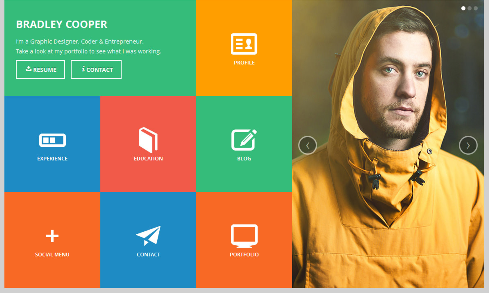
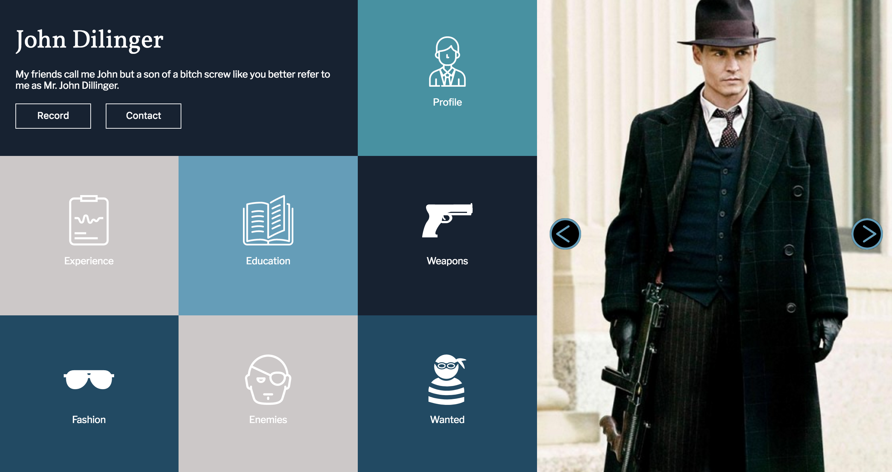

This is my static comp 1 challenge project.  The objective
of this project was to replicate the comp that was given to us.
We were given creative license to choose color palette, text, and images.  In my html document I created two containers that hold my content.  One container which is positioned on the left of the page holds my main content and the right container holds my images.  I used used display flex on the left main container and in various other parts of the page to achieve the positioning that I wanted. My biggest challenge was making the page responsive.   

